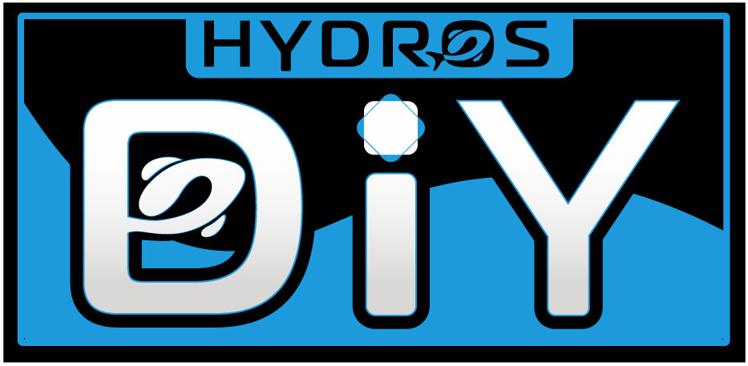
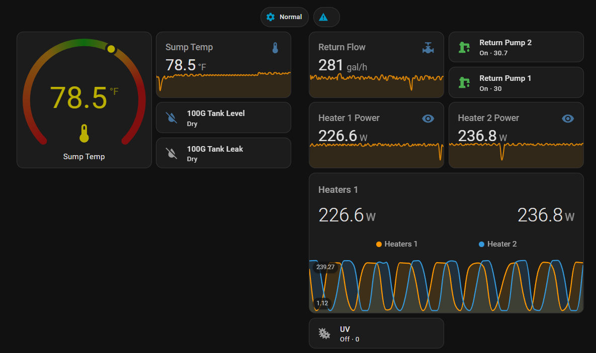

# HA-Hydros (Custom Integration)

## Getting your API keys

This integration uses CoralVue's official [HYDROS Public API](https://www.coralvuehydros.com/api/), which needs two keys:

1. **Provider key**: issued by CoralVue. Request one with the form at <https://www.coralvuehydros.com/api/#request-provider-key>. Individuals can request an unlisted provider key for personal use, such as this integration.
2. **Device key**: generated in the HYDROS app (Device Properties → Manage API Keys), one per device or collective. When generating it, select your provider key. Choose **read & write** permission if you want to control outputs from Home Assistant; a read-only key can only monitor.

Then add the integration in Home Assistant (**Settings → Devices & services → Add integration → HA-Hydros**) and enter both keys.

Treat both keys like passwords: don't share them or post them in issues or logs. Per CoralVue, API access is free through 2026, and stays free afterwards for up to 20 device keys per provider key.

**Upgrading from a version that used your Hydros username and password?** Home Assistant asks you to re-authenticate. Enter a provider/device key pair for each collective you had configured. Existing entities, and their history, are moved over wherever a matching entity exists in the new API.

## Summary
Custom Home Assistant integration for Hydros controllers. It connects to the Hydros cloud API to expose inputs, outputs, dosing history, and device health in Home Assistant.

⚠️ DO NOT rely on this integration's automations for life-critical functions (e.g temperature control, pumps) or when equipment/property damage can occur (e.g flood).

⚠️ This integration require internet to function and integrate with Hydros' cloud. Network issues will cause sensors to become unavailable (and automation to fail).

🛡️Leverage Hydros' own controller features for such functions as they have built-in resiliency for network & power outages and built-in safeguards.

Example of good usage for this integration includes: long term metrics, triggering alerts, automation to non life supporting 3rd party devices (e.g light, smart switch).

## Capabilities

- **Config flow**: a provider key and device key per Hydros device or collective; several devices can share one entry.
- **Sensors**:
  - Inputs (temperature, probes, flow, triple-level float switches, etc.). Units are a best-effort guess from the input's name, since the API doesn't report them.
  - Output measurements (power, voltage, current, frequency) and dosing pump reservoir levels.
  - Doser totals (**Dosed Today**) from the Hydros logs API.
  - Controller health per node (bus voltage/current, temperature, boot time, Wi-Fi/SD card status, self-tests).
  - Alerts summary, firmware version, and collective status.
- **Binary sensors**: on/off inputs (e.g. leak detectors) and a **Running** sensor per output.
- **Controls** (need a read & write device key): output overrides (On/Off/Auto), variable output levels, operating mode, and output commands such as a doser's manual dose.
- **Refresh**: device state every 7 seconds; dosing totals every 5 minutes.

## Notes
- API keys are stored in Home Assistant's config entry storage (`.storage/core.config_entries`), unencrypted like every integration's credentials, so protect your Home Assistant backups. They aren't shown in the UI, logs, or entity attributes.
- The state-polling session is cached in `.storage/hydros.session.<device id>` so restarts don't exhaust the API's limit of 5 new sessions per hour. It's deleted when you remove the integration.

## ⚠️ Safety Warning & Disclaimer 

HA-Hydros is provided “as is” and “with all faults”, without warranty of any kind, express or implied. The author makes no representations or guarantees regarding safety, suitability, accuracy, reliability, availability, or fitness for any particular purpose.

This software is not designed, tested, or intended for safety-critical, life-supporting, or fail-safe control systems. Do not rely on this integration for life-critical functions (e.g. temperature control, circulation, oxygenation) or for scenarios where equipment failure could result in property damage (e.g. floods, electrical hazards, or fire).

Use of this software is entirely at your own risk. Improper configuration, software defects, network outages, cloud service changes, or unexpected behavior may result in equipment malfunction, property damage, or loss of aquatic life.

Always validate behavior in a controlled or non-critical environment before enabling automations. For critical functions, use Hydros’ native controller features, which are specifically designed with local control, redundancy, and safety safeguards.

In no event shall the author be liable for any direct, indirect, incidental, special, exemplary, or consequential damages arising from the use of, or inability to use, this software.

Nothing in this project constitutes professional, electrical, or safety advice.

This project is an independent, community-driven effort and is not affiliated with, authorized, maintained, or endorsed by CoralVue or Hydros. “Hydros” and “CoralVue” are trademarks of their respective owners and are used for identification purposes only.

## License

Licensed under MIT license
